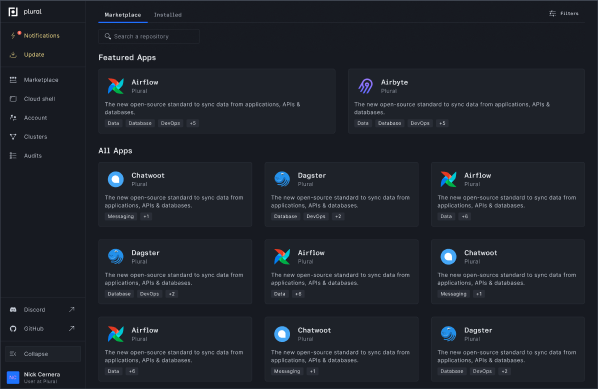

# 🏁 Quickstart

## Overview

This is a guide on how to get Plural running using our CLI. If you prefer an in-browser Cloud Shell experience with all the dependencies loaded, check out our _Quickstart Guide for Cloud Shell_ [here](../basic-setup-and-deployment/cloud-shell-quickstart.md).

## Prerequisites

You will need the following things to successfully get up and running with Plural:

* **A cloud account**: Plural will deploy directly into your cloud provider of choice. We currently support AWS, GCP and Azure. Follow [this guide](../reference/configuring-cloud-provider.md) to make sure it's set up correctly.
* **Your cloud provider CLI installed and configured**: Plural will leverage your cloud provider's CLI tooling in places.

## Install Plural CLI

The Plural CLI and its dependencies are available using a package manager for your system. For Mac, we recommend using [Homebrew](https://brew.sh/). For other operating systems, curl and our Docker image should work universally.



The brew tap will install Plural, alongside Terraform, Helm and kubectl for you. If you've already installed any of those dependencies, you can add `--without-helm`, `--without-terraform`, or `--without-kubectl`

```
brew install pluralsh/plural/plural
```



You can download the binaries attached to our GitHub releases [here](https://github.com/pluralsh/plural-cli/releases). There will be binaries for linux, windows, and mac and all compatible platforms.

For example, you can download v0.2.57 for Darwin arm64 via:

```
curl -L -o plural.tgz 'https://github.com/pluralsh/plural-cli/releases/download/v0.2.57/plural-cli_0.2.57_Darwin_arm64.tar.gz'
tar -xvf plural.tgz
chmod +x plural
mv plural /usr/local/bin/plural
```


Be sure to download the CLI version for your target OS/architecture, the above example is only valid for ARM Mac's


You will still need to ensure helm, terraform and kubectl are properly installed, you can find installers for each here

| Tool      | Installer                                                                                                                  |
| --------- | -------------------------------------------------------------------------------------------------------------------------- |
| helm      | [https://helm.sh/docs/intro/install/](https://helm.sh/docs/intro/install/)                                                 |
| terraform | [https://learn.hashicorp.com/tutorials/terraform/install-cli](https://learn.hashicorp.com/tutorials/terraform/install-cli) |
| kubectl   | [https://kubernetes.io/docs/tasks/tools/#kubectl](https://kubernetes.io/docs/tasks/tools/#kubectl)                         |



We offer a docker image with the plural CLI installed along with all CLI dependencies: terraform, helm, kubectl, and all the major cloud CLI's: gcr.io/pluralsh/plural-cli:0.1.1-cloud. We also provide a decent configuration of zsh in it, so you can drive the entire plural workflow in an interactive session. The best strategy is probably to mount the config dir of the cloud provider you're using, like (\~/.aws), in the docker run command:

```
docker run -it --volume $HOME/.aws:/home/plural/aws \
               --volume $HOME/.plural:/home/plural/.plural \
               --volume $HOME/.ssh:/home/plural/.ssh \
               --volume $HOME/PATH_TO_INSTALLATION_REPO:/home/plural/workspace \ # optional if you want to manage git via a volume
    gcr.io/pluralsh/plural-cli:0.1.1-cloud zsh
```

Once you're in the container's zsh, you'll want to clone the repo you'll use for your installations state there, or alternatively you can clone it outside your container and mount another volume pointing to it.



We have EC2 AMI's with the Plural CLI installed, along with all cloud provider clis, terraform, helm and kubectl for those interested in creating a remote environment. A registry of the AMIs can be viewed here: [https://github.com/pluralsh/plural-cli/blob/master/packer/manifest.json](https://github.com/pluralsh/plural-cli/blob/master/packer/manifest.json)

If there's interest in images for GCP and Azure, feel free to leave feedback in our [Discord](https://discord.gg/pluralsh) or open a [GitHub issue](https://github.com/pluralsh/plural/issues/new/choose).

This doc gives more details on launching AMIs if you are unfamiliar: [https://aws.amazon.com/premiumsupport/knowledge-center/launch-instance-custom-ami/](https://aws.amazon.com/premiumsupport/knowledge-center/launch-instance-custom-ami/). You'll want to select "Public images" within the ami search bar and you can use the ami id embedded in the `artifact_id` in our manifests, eg `ami-0249247d5fc865089`. Be sure to chose the one for the appropriate region.




Before you proceed, make sure that your cloud provider CLI is properly configured and updated to the latest version. If you aren't sure about how to do that, refer to [this guide](../reference/configuring-cloud-provider.md). If it is not configured correctly, Plural will fail and won't be able to create resources on your behalf.


## Create your Plural Repo

Plural stores all configuration artifacts within a Git repository that we will create on your behalf. Run this command within the directory that you want to store your configuration in:

```
plural init
```

The Plural CLI will then guide you through a workflow using GitHub/GitLab OAuth to create a repository on your behalf.


Currently we're limited to a one cluster to one repo mapping, but eventually that will be relaxed. We also strongly urge users to store installations in a fresh, separate repository to avoid our automation trampling existing files.


Along the `plural init` workflow, we will set the Git attributes to configure encryption and configure your cloud provider for this installation.

You will also be asked whether you want to use Plural's domain service and if so, what you want the subdomain to be. We recommend that you use our DNS service if you don't have any security reasons that prevent you from doing so. The hostname that you configure with us will determine where your applications are hosted. For example, if you enter `singular.onplural.sh`, your applications will be available at `$APP_NAME.singular.onplural.sh`.

This process will generate a `workspace.yaml` file at the root of your repo that stores your cloud provider configuration information.

## Install Plural Applications



To view the applications you can install on Plural, point your browser to [https://app.plural.sh/explore/public](https://app.plural.sh/explore/public)

Alternatively, you can run `plural repos list` on the CLI or Cloud Shell.

Run `plural bundle list <app-name>` to find installation commands and information about each application available for install. For example, to list the bundle information for the Plural console, a powerful Kubernetes control plane:

```
plural bundle list console
```

To install applications on Plural, run:

```
plural bundle install <app-name> <bundle-name>
```

We can try this out by installing the Plural Console:



```
plural bundle install console console-aws
```



```
plural bundle install console console-gcp
```



```
plural bundle install console console-azure
```



After running the install command, you will be asked a few questions about how your app will be configured, including whether you want to enable **Plural OIDC** (single sign-on). Unless you don't wish to use Plural as an identity provider due to internal company security requirements, you should enter (Y). This will enable you to use your existing `app.plural.sh` login information to access Plural-deployed applications. This will add an extra layer of security for applications without built-in authentication.

Ultimately all the values you input at this step will be stored in a file called `context.yaml` at the root of your repo.

## Build and Deploy your Kubernetes Cluster and Applications

With all bundles installed, run:

```bash
plural build
plural deploy --commit "initial deploy"
```

This will generate all deployment artifacts in the repo, then deploy them in dependency order.

It is common for `plural deploy` to take a fair amount of time, as is the case with most Terraform and cloud infrastructure deployments. Network disconnects can cause potential issues as a result. If you're running on a spotty network, or would like to step out while it's running we recommend running it in [tmux](https://github.com/tmux/tmux/wiki).

Once `plural deploy` has completed, you should be ready to log in to your application at `{app-name}.{domain-name}`.


You may experience a delayed creation of your SSL certs for your applications. ZeroSSL currently may take up to 24 hours to provide you your certs.


**And you are done!** You now have a fully-configured Kubernetes cluster and are free to install applications on it to your heart's content. If you want to take down any of your individual applications, run `plural destroy <APP-NAME>`. If you're just testing us out and want to take down the entire thing, run `plural destroy`.
